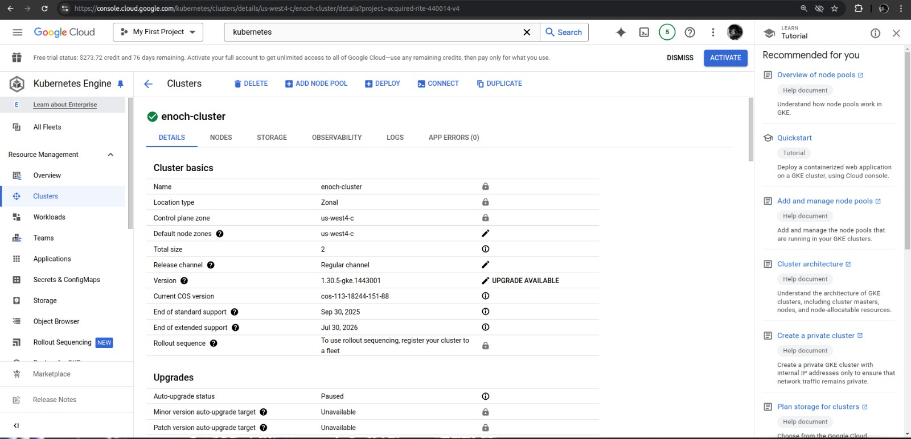
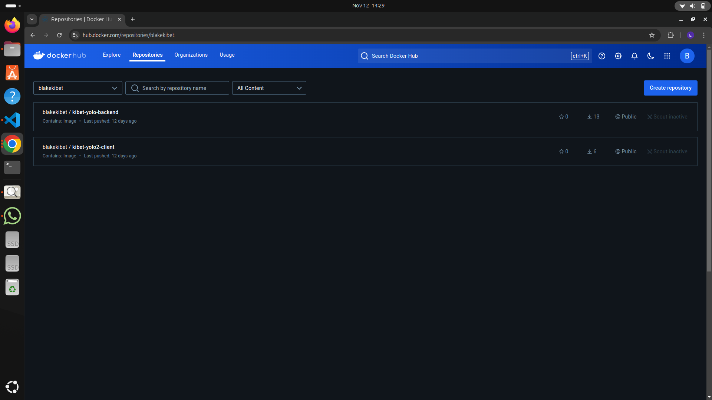

**YOLO PROJECT**
This project demonstrates a microservice architecture with Docker, Docker Compose, and Kubernetes for a full-stack application. It includes a React frontend, a Node.js backend, and MongoDB for data storage.


*PROJECT LINK* http://34.57.152.165:3000



*Requirements*
Make sure that you have the following installed:

node
npm
MongoDB and start the mongodb service with sudo service mongod start
Navigate to the Client Folder
cd client

Run the folllowing command to install the dependencies
npm install

Run the folllowing to start the app
npm start

Open a new terminal and run the same commands in the backend folder
cd ../backend

npm install

npm start

Go ahead a nd add a product (note that the price field only takes a numeric input)
1. Choice of Base Image
The base image used to build the containers is node:16-alpine3.16. It is derived from the Alpine Linux distribution, making it lightweight and compact. Used

Client:node:16-alpine3.16
Backend: node:16-alpine3.16 3.Mongo : mongo:6.0 
2. Dockerfile directives used in the creation and running of each container.
I used two Dockerfiles. One for the Client and the other one for the Backend.

Client Dockerfile

# Build stage
FROM node:16-alpine3.16 as build-stage

# Set the working directory inside the container
WORKDIR /client

# Copy package.json and package-lock.json
COPY package*.json ./

# Install dependencies and clears the npm cache and removes any temporary files
RUN npm install --only=production && \
    npm cache clean --force && \
    rm -rf /tmp/*

# Copy the rest of the application code
COPY . .

# Build the application and  remove development dependencies
RUN npm run build && \
    npm prune --production

# Production stage
FROM node:16-alpine3.16 as production-stage

WORKDIR /client

# Copy only the necessary files from the build stage
COPY --from=build-stage /client/build ./build
COPY --from=build-stage /client/public ./public
COPY --from=build-stage /client/src ./src
COPY --from=build-stage /client/package*.json ./

# Set the environment variable for the app
ENV NODE_ENV=production

# Expose the port used by the app
EXPOSE 3000

# Prune the node_modules directory to remove development dependencies and clears the npm cache and removes any temporary files


# Start the application
CMD ["npm", "start"]

Backend Dockerfile

# Set base image
FROM node:16-alpine3.16

# Set the working directory
WORKDIR /backend

# Copy package.json and package-lock.json to the container
COPY package*.json ./

# Install dependencies and clears the npm cache and removes any temporary files
RUN npm install --only=production && \
    npm cache clean --force && \
    rm -rf /tmp/*

# Copy the rest of the application code
COPY . .

# Set the environment variable for the app
ENV NODE_ENV=production

# Expose the port used by the app
EXPOSE 5000

# Prune the node_modules directory to remove development dependencies and clears the npm cache and removes any temporary files
RUN npm prune --production && \
    npm cache clean --force && \
    rm -rf /tmp/*

# Start the application
CMD ["npm", "start"]

3. Docker Compose Networking
The (docker-compose.yml) defines the networking configuration for the project. It includes the allocation of application ports. The relevant sections are as follows:

services:
  backend:
    # ...
    ports:
      - "5000:5000"
    networks:
      - yolo-network

  client:
    # ...
    ports:
      - "3000:3000"
    networks:
      - yolo-network
  
  mongodb:
    # ...
    ports:
      - "27017:27017"
    networks:
      - yolo-network

networks:
  yolo-network:
    driver: bridge
In this configuration, the backend container is mapped to port 5000 of the host, the client container is mapped to port 3000 of the host, and mongodb container is mapped to port 27017 of the host. All containers are connected to the yolo-network bridge network.

4. Docker Compose Volume Definition and Usage
The Docker Compose file includes volume definitions for MongoDB data storage. The relevant section is as follows:

yaml

volumes:
  mongodata:  # Define Docker volume for MongoDB data
    driver: local

This volume, mongodb_data, is designated for storing MongoDB data. It ensures that the data remains intact and is not lost even if the container is stopped or deleted.

5. Git Workflow to achieve the task
To achieve the task the following git workflow was used:

Fork the repository from the original repository.

Clone the repo: git@github.com:Maubinyaachi/yolo-Microservice.git

Create a .gitignore file to exclude unnecessary files and directories from version control.

Added Dockerfile for the client to the repo: git add client/Dockerfile

Add Dockerfile for the backend to the repo: git add backend/dockerfile

Committed the changes: git commit -m "Added Dockerfiles"

Added docker-compose file to the repo: git add docker-compose.yml

Committed the changes: git commit -m "Added docker-compose file"

Pushed the files to github: git push 

Built the client and backend images: docker compose build

Pushed the built imags to docker registry: docker compose push

Deployed the containers using docker compose: docker compose up

Created explanation.md file and modified it as the commit messages in the repo will explain.

6. Debugging measures applied.
docker build -t <imagename:version> to build an image.
docker images / docker image ls to check images built.
docker ps to check running containers.
docker ps -a to check all container status.
docker login to log in to DockerHub.
docker push <username:image> to deploy image to DockerHub.
docker compose down followed by docker compose up for restarts.
docker compose logs push to deploy it to Dockerhub.
docker compose logs <service> for logs. -docker network ls / docker network inspect to check and inspect available networks
7. Docker image tag naming standards for ease of identification of images and containers.
used docker image ls to check images have tags as follows.

Images are tagged using this versioning (v1.0.0):

blakekibet/kibet-yolo2-client
blakekibet/kibet-yolo-backend
"Docker tags" "Docker tags"

Orchestration IP 4
1. Introduce K8s Manifests
    kubectl apply -f persistent-volume.yaml
    kubectl apply -f persistent-volume-claim.yaml
    kubectl apply -f database-statefulset.yaml
    kubectl apply -f database-service.yaml
    kubectl apply -f backend-deployment.yaml
    kubectl apply -f backend-service.yaml
    kubectl apply -f frontend-deployment.yaml
    kubectl apply -f frontend-service.yaml
2. Confirm deployments
Confirm the status of the services:

```bash
kubectl get services
```

Make sure the `EXTERNAL-IP` is assigned to access the client and backend.
a. MongoDB StatefulSet
The MongoDB StatefulSet ensures data persistence even if pods restart:

File: database-statefulset.yaml
Service: database-service.yaml
b. Backend Deployment
The backend service handles API requests:

File: backend-deployment.yaml
Service: backend-service.yaml
c. Frontend Deployment
The frontend serves the React application:

File: frontend-deployment.yaml
Service: frontend-service.yaml
Connecting to MongoDB
The backend connects to MongoDB using the following connection string:

const mongodb_url = 'mongodb://mongo-service:27017/yolomy';
